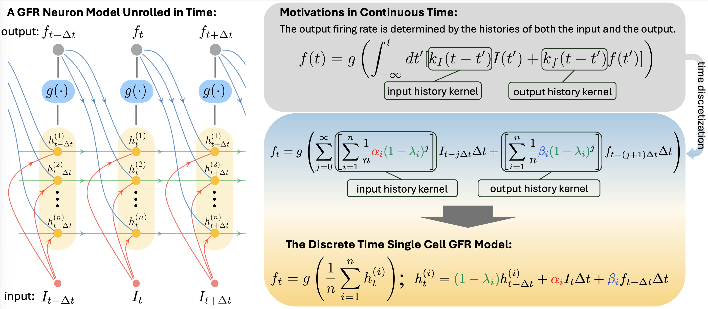
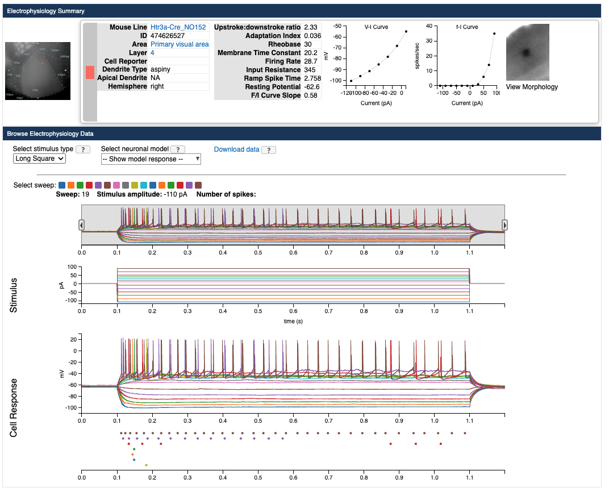
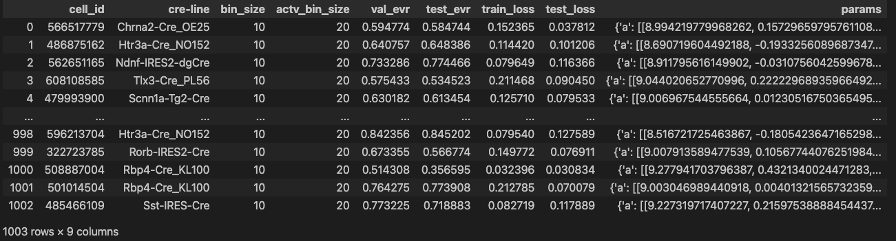

# Generalized Firing Rate Neurons
## The GFR Model

The GFR model models the firing rate of a neuron as

$$f_t = g\left( \frac{1}{n}\sum_{i=1}^n h^{(i)}_t \right)$$

$$h^{(i)}_t = (1-\lambda_i) h^{(i)}_{t-\Delta t} + \Delta t\alpha_i I_t + \Delta t\beta_i f_{t-\Delta t}$$

for $i=1,\dots,n$. $\lambda_i\leq 0$ are exponential decay rates, $\alpha_i$ and $\beta_i$ are exponential weights, and $\Delta t>0$ is an arbitrary time constant to ensure that the argument of the exponential function is dimensionless. $g$ is an activation function

$$
g(x) = \gamma\text{ReLU}\left(\text{tanh}\left(\text{poly}\left(x\right)\right)\right)\text{ s.t. }\mathrm{poly}(x)=\frac{a_0^2+a_1^2(x-b)+...+a_d^2(x-b)^d}{\sigma}
$$

$a_0,...,a_d$ are trainable parameters. We square $a_i$ to ensure the coefficients are non-negative. We pre-compute $\gamma$, the maximum firing rate of the neuron, $b$, the firing threshold, and $\sigma$, the maximum experimental current. $\gamma$ and $\sigma$ are fixed during training.

We fit the activation function before fitting the entire model. We train different configurations of bin sizes $\Delta t$ for the model and activation bin sizes $\Delta t'$ for the activation function.

## Dataset
The dataset consists of trained GFR model parameters for different configurations of bin sizes and activation bin sizes. We only include models that pass certain criteria, namely:
- The data includes both noise 1 and noise 2 sweeps (used for validation and testing)
- The validation explained variance ratio is greater than 0.5
- The training loss (Poisson negative log likelihood) is less than 0.45

The table below lists the number of cells satisfying the above criteria:
| Bin size (ms) | Activation bin size (ms) | # cells |
|:-------------:|:------------------------:|---------|
|       10      |            20            | 1003    |
|       10      |            100           | 769     |
|       20      |            20            | 1124    |
|       20      |            100           | 1407    |
|       50      |            100           | 1524    |
|      100      |            100           | 1402    |

### Accessing Cell Information
All GFR models were trained on the Allen Institute Electrophysiology Database. Each model has a corresponding cell id, whose information can be viewed in the [Allen Brain Atlas](https://celltypes.brain-map.org/experiment/electrophysiology/474626527).

For example, searching for cell id 474626527 gives us the following on the database:


## Loading the dataset
To load the dataset, run
```
import json

with open("model/gfr_dataset.json", "r") as f:
    json_dataset = json.load(f)
```

To convert the dataset into a Pandas DataFrame format, run
```
import utils

dataset = utils.df_from_json(json_dataset)
```

The dataset is a dictionary where keys are bin size, activation bin size pairs, and the values are dataframes. Each dataframe includes information about cell id, cre-line, validation and test explained variance ratio, train and test loss, and GFR model parameters.

Thus running
``
dataset.keys()
``
we get the keys
```
dict_keys([(10, 20), (10, 100), (20, 20), (20, 100), (50, 100), (100, 100)])
```
corresponding to different bin size, activation bin size pairs. As an example, ``dataset[(10, 20)]`` gives us a pandas DataFrame


To load a specific GFR model, use
```
load_gfr_model(dataset, cell_id, bin_size, activation_bin_size)
```
in `utils.py`. For example, running
```
import utils

model = utils.load_gfr_model(dataset, 566517779, 10, 20)
```
gives us a GFR module 
```
GFR(
  (g): PolynomialActivation()
)
```
with with corresponding parameters saved in the dataset. Running
```
model.get_params()
```
gives us a dictionary containing the model parameters, which has the following strucutre:

- `a`: $\alpha_1,\dots,\alpha_n$
- `b`: $\beta_1,\dots,\beta_n$
- `bin_size`: model bin size $\Delta t$
- `g`: a nested object encoding the activation function containing:
    - `max_current`: $\sigma$
    - `max_firing_rate`: $\gamma$
    - `poly_coeff`: $a_0,\dots,a_d$
    - `b`: $b$
    - `bin_size`: activation bin size $\Delta t'$
    - `ds`: decay coefficients $\lambda_i$


## Reproducing Results
### Preprocessing data
To download and preprocess the data, run
```
python preprocess_pipeline.py --cell_ids [cell_ids]
```
where `[cell_ids]` is the path to a CSV file containing the cell ids of all the cells you want to preprocess. If not specified, all cell ids available will be used. A corresponding CSV with all cell ids will be saved in `data/cell_ids.csv`.

The preprocessed data will be saved as a pickle file in `data/processed_data/` as `processed_I_and_firing_rate_{cell_id}.pickle` for each cell id in the specified CSV file.

WARNING: this process will take a while.

### Training GFR neurons
To train the model, run
```
python model_pipeline.py [cell_ids] --bin_size [bin_size] --activation_bin_size [activation_bin_size] --degree [degree] --C [C] --save_path [save_path] --config_path [config_path]
```
where
- `[cell_ids]`: path to a CSV file containing the cell ids of all the cells you want to train models for.
- `[bin_size]`: time bin size used for discretizing the spike data for training the GFR model (not including activation function).
    - Default: 20
    - Allowed values: 10, 20, 50, 100
- `[activation_bin_size]`: time bin size used for discretizing the spike data for training the activation function.
    - Default: 20
    - Allowed values: 20, 100
- `[degree]`: degree of the polynomial in the activation function.
    - Default: 1
- `[C]`: constant for L1 regularization on the GFR model.
    - Default: 0
- `[save_path]`: path to save folder for models.
    - Default: `model/params/`
- `[config_path]`: path to config file specifying training parameters (see `configs/default.json` for an example).
    - Default: `configs/default.json`

### Training a network of GFR neurons for L-MNIST
To train the network, run
```
python network_pipeline.py [lr] [epochs] [batch_size][n_nodes] [freeze_neurons] [freeze_activations]
```
where
- `[lr]`: learning rate used for training the network.
- `[epochs]`: number of training epochs.
- `[batch_size]`: training batch size.
- `[n_nodes]`: number of recurrent nodes in the network.
- `[freeze_neurons]`: freeze neuron weights when training; only train recurrent connections and input/output weights.
- `[freeze_activation]`: freeze activation weights.