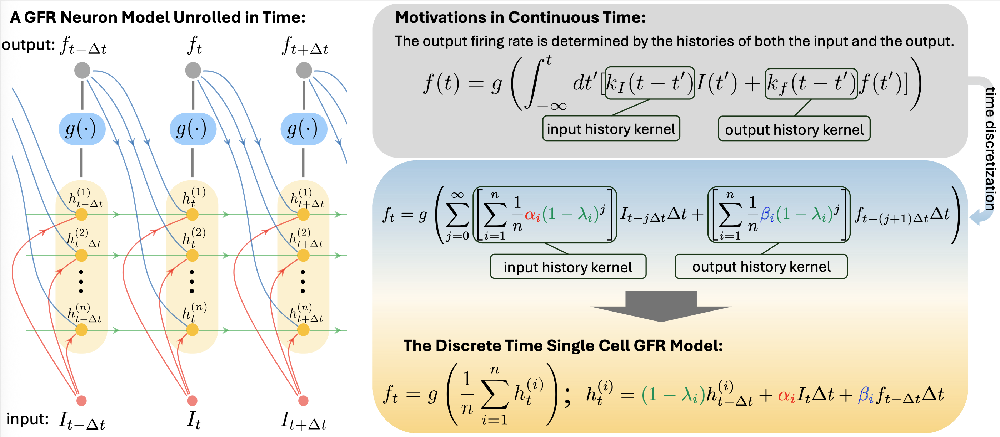
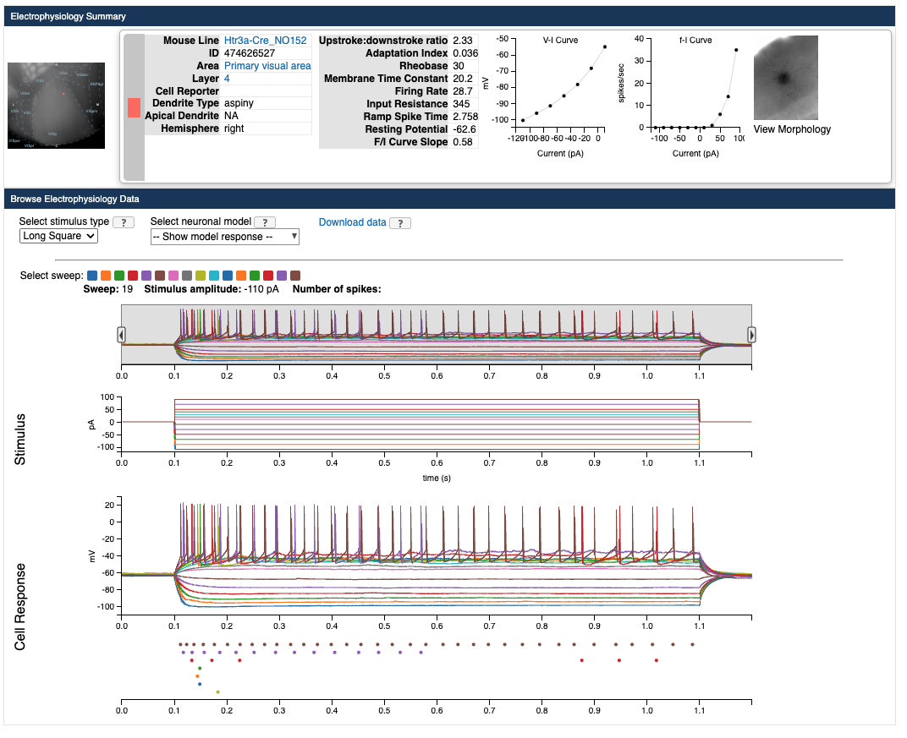
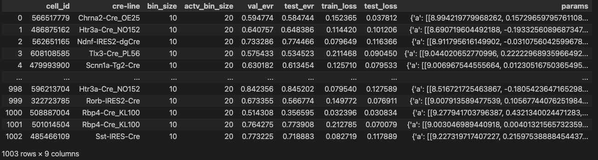

# Generalized Firing Rate Neurons

This repository is the resource release accompanying the GFR (Generalized Firing
Rate) neuron paper. Its **primary deliverable is a dataset of fitted GFR neuron
models** derived from the Allen Institute Cell Types electrophysiology database,
together with the code needed to load, use, and reproduce them. The trained
network experiments and analyses below are built on top of that resource.

### Repository contents

**Resource — the distributed dataset (this is what the paper provides):**
- `model/gfr_dataset.json` — fitted GFR model parameters for every qualifying cell across six (bin size, activation bin size) configurations. Load with `utils.df_from_json` (see [Loading the dataset](#loading-the-dataset)).
- `model/best_params.pickle` — the raw best-fit parameters behind the dataset.
- `data/metadata.csv`, `data/labels.pickle` — per-cell metadata (cre-line, species, layer, …) and labels.
- `images/` — the schematic and example-database screenshots used below.

**Core code — model, fitting, and reproduction pipelines:**
- `model.py`, `network.py`, `snn_network.py`, `utils.py`, `data.py`, `config.py`, `evaluate.py`, `train.py`
- `preprocess_pipeline.py`, `model_pipeline.py`, `network_pipeline.py`, `snn_pipeline.py`
- `configs/` — training configurations.

**Revision results and analyses (added in this revision, built on the resource):**
- `results/` — frozen artifacts and checkpoints backing the manuscript's quantitative L-MNIST tables (per-step accuracy across GFR-RNN / RNN / SNN, and biological-vs-random initialization). See [`results/README.md`](results/README.md).
- `species_analysis/` — human vs. mouse GFR-parameter comparison (figure + statistics). See [`species_analysis/README.md`](species_analysis/README.md).
- Notebooks: `cluster.ipynb` and `cluster-split-test.ipynb` (parameter clustering and the split-half relative-importance robustness analysis), `activation_benchmark.ipynb` (activation-function comparison), `appendix_gfr_rnn_vs_snn.ipynb` (GFR-RNN vs. SNN appendix), `data_visualization.ipynb`.

## The GFR Model

The GFR model models the firing rate of a neuron as

```math
f_t = g\left( \frac{1}{n}\sum_{i=1}^n h^{(i)}_t \right)
```

```math
h^{(i)}_t = (1-\lambda_i)\,h^{(i)}_{t-\Delta t}
  + \Delta t\,\alpha_i\,I_t
  + \Delta t\,\beta_i\,f_{t-\Delta t}
```

for $i=1,\dots,n$. $\lambda_i\in[0,1]$ are exponential decay rates, $\alpha_i$ and $\beta_i$ are exponential weights, and $\Delta t>0$ is an arbitrary time constant to ensure that the argument of the exponential function is dimensionless. $g$ is an activation function

```math
g(x) = \gamma\text{ReLU}\left(\text{tanh}\left(\text{poly}\left(x\right)\right)\right)\text{ s.t. }\mathrm{poly}(x)=\frac{a_0^2+a_1^2(x-b)+...+a_d^2(x-b)^d}{\sigma}
```

$a_0,...,a_d$ are trainable parameters. We square $a_i$ to ensure the coefficients are non-negative. We pre-compute $\gamma$, the maximum firing rate of the neuron, $b$, the firing threshold, and $\sigma$, the maximum experimental current. $\gamma$ and $\sigma$ are fixed during training.

We fit the activation function before fitting the entire model. We train different configurations of bin sizes $\Delta t$ for the model and activation bin sizes $\Delta t'$ for the activation function.

## Dataset
The dataset consists of trained GFR model parameters for different configurations of bin sizes and activation bin sizes. We only include models that pass certain criteria, namely:
- The data includes both noise 1 and noise 2 sweeps (used for validation and testing)
- The validation explained variance ratio is greater than 0.5
- The training loss (Poisson negative log likelihood) is less than 0.45

The table below lists the number of cells satisfying the above criteria:
| Bin size (ms) | Activation bin size (ms) | # cells |
|:-------------:|:------------------------:|---------|
|       10      |            20            | 1003    |
|       10      |            100           | 769     |
|       20      |            20            | 1124    |
|       20      |            100           | 1407    |
|       50      |            100           | 1524    |
|      100      |            100           | 1402    |

### Accessing Cell Information
All GFR models were trained on the Allen Institute Electrophysiology Database. Each model has a corresponding cell id, whose information can be viewed in the [Allen Brain Atlas](https://celltypes.brain-map.org/data).

For example, searching for cell id 474626527 gives us the following on the database:


## Loading the dataset
To load the dataset, run
```
import json

with open("model/gfr_dataset.json", "r") as f:
    json_dataset = json.load(f)
```

To convert the dataset into a Pandas DataFrame format, run
```
import utils

dataset = utils.df_from_json(json_dataset)
```

The dataset is a dictionary where keys are bin size, activation bin size pairs, and the values are dataframes. Each dataframe includes information about cell id, cre-line, validation and test explained variance ratio, train and test loss, and GFR model parameters.

Thus running
``
dataset.keys()
``
we get the keys
```
dict_keys([(10, 20), (10, 100), (20, 20), (20, 100), (50, 100), (100, 100)])
```
corresponding to different bin size, activation bin size pairs. As an example, ``dataset[(10, 20)]`` gives us a pandas DataFrame


To load a specific GFR model, use
```
load_gfr_model(dataset, cell_id, bin_size, activation_bin_size)
```
in `utils.py`. For example, running
```
import utils

model = utils.load_gfr_model(dataset, 566517779, 10, 20)
```
gives us a GFR module 
```
GFR(
  (g): PolynomialActivation()
)
```
with with corresponding parameters saved in the dataset. Running
```
model.get_params()
```
gives us a dictionary containing the model parameters, which has the following structure:

- `a`: $\alpha_1,\dots,\alpha_n$
- `b`: $\beta_1,\dots,\beta_n$
- `ds`: decay coefficients $\lambda_i$
- `bin_size`: model bin size $\Delta t$
- `g`: a nested object encoding the activation function containing:
    - `max_current`: $\sigma$
    - `max_firing_rate`: $\gamma$
    - `poly_coeff`: $a_0,\dots,a_d$
    - `b`: $b$
    - `bin_size`: activation bin size $\Delta t'$


## Reproducing Results
### Preprocessing data
To download and preprocess the data, run
```
python preprocess_pipeline.py --cell_ids [cell_ids]
```
where `[cell_ids]` is the path to a CSV file containing the cell ids of all the cells you want to preprocess. If not specified, all cell ids available will be used. A corresponding CSV with all cell ids will be saved in `data/cell_ids.csv`.

The preprocessed data will be saved as a pickle file in `data/processed_data/` as `processed_I_and_firing_rate_{cell_id}.pickle` for each cell id in the specified CSV file.

WARNING: this process will take a while.

### Training GFR neurons
To train the model, run
```
python model_pipeline.py [cell_ids] --bin_size [bin_size] --activation_bin_size [activation_bin_size] --degree [degree] --C [C] --save_path [save_path] --config_path [config_path]
```
where
- `[cell_ids]`: path to a CSV file containing the cell ids of all the cells you want to train models for.
- `[bin_size]`: time bin size used for discretizing the spike data for training the GFR model (not including activation function).
    - Default: 20
    - Allowed values: 10, 20, 50, 100
- `[activation_bin_size]`: time bin size used for discretizing the spike data for training the activation function.
    - Default: 20
    - Allowed values: 20, 100
- `[degree]`: degree of the polynomial in the activation function.
    - Default: 1
- `[C]`: constant for L0 regularization on the GFR model.
    - Default: 0
- `[save_path]`: path to save folder for models.
    - Default: `model/params/`
- `[config_path]`: path to config file specifying training parameters (see `configs/default.json` for an example).
    - Default: `configs/default.json`

### Training a network of GFR neurons for L-MNIST
To train the network, run
```
python network_pipeline.py [lr] [epochs] [batch_size] [n_nodes] [freeze_neurons] [freeze_activations]
```
where
- `[lr]`: learning rate used for training the network.
- `[epochs]`: number of training epochs.
- `[batch_size]`: training batch size.
- `[n_nodes]`: number of recurrent nodes in the network.
- `[freeze_neurons]`: freeze neuron weights when training; only train recurrent connections and input/output weights.
- `[freeze_activations]`: freeze activation weights.

For example, to reproduce the L-MNIST results from the paper (Section 3.4, Appendix C.1):
```
python network_pipeline.py 1e-3 300 128 64 False True
```
This trains a GFR-RNN with 64 hidden neurons, default initialization, learnable neuron parameters ($\alpha$, $\beta$), and frozen activation function $g$.

#### Note on `bio_units`
The GFR model includes a `bio_units` flag that controls the scaling of the recurrent feedback term ($\beta$). When `bio_units=True` (default), firing rates are scaled by a factor of 1000 to convert from spikes/ms to Hz, which is appropriate for biological neuron fitting. When `bio_units=False`, no scaling is applied, which is appropriate for abstract tasks like sequential MNIST where inputs are unitless. The `network_pipeline.py` script uses `bio_units=False` for L-MNIST training.

### Per-step readout accuracy and initialization studies (manuscript tables)

The manuscript's quantitative L-MNIST comparisons are produced by a set of
from-scratch, parameter-matched training and evaluation scripts. Their frozen
outputs, rendered tables, and trained checkpoints are archived under `results/`
(see [`results/README.md`](results/README.md) for the full artifact-to-table
mapping and per-artifact regeneration commands).

**Per-step accuracy — GFR-RNN vs. RNN vs. SNN** (Table `tab:per-step-accuracy`).
Four models are trained from scratch at a matched (~7.3k) parameter budget and
evaluated with per-step and majority-vote readouts:
```
python run_stage1_rnn_param_match.py   # GFR-RNN (hidden 65)
python run_rnn_checkpoint_rerun.py     # vanilla RNN (hidden 68)
python run_snn_phase1_param_match.py   # SNN-LIF and SNN-Synaptic (hidden 68)
python eval_single_step_accuracy.py    # -> results/per_step_accuracy/
```

**Biological vs. random initialization** (Table `tab:bio-init-per-step-percent`).
128-unit GFR-RNNs are initialized with random or biological GFR parameters, under
trainable vs. frozen recurrent dynamics:
```
python reproduce_bio_init_table.py       # -> results/bio_init/results.json (+ checkpoints)
python generate_bio_init_latex_table.py  # -> results/bio_init/bio_init_per_step_table_percent.tex
```

**Activation-function comparison** (Table `tab:acti-compare`) is produced inline
by `activation_benchmark.ipynb`.

### Optional: standalone GFR-RNN vs. SNN demo

`compare_models.py` is a self-contained script that trains and compares a
GFR-RNN against spiking baselines in a single run. It is provided as a quick,
reproducible demonstration; the manuscript's Table `tab:per-step-accuracy` is
produced by the parameter-matched pipeline above, not by this script. To run the
demo:
```
python compare_models.py --epochs 300 --hidden_dim 64 --batch_size 128 --lr 1e-3 --variant l --seed 42
```

For a notebook version of the same benchmark that renders the summary inline and saves appendix-ready artifacts, open `appendix_gfr_rnn_vs_snn.ipynb` from the repo root. The notebook calls the shared comparison code, writes checkpoints and a JSON summary for the run, and also saves a CSV table plus PNG figures under `paper_submission/appendix_outputs/<run_name>/`.

This trains three models with identical architecture, data splits, training protocol, and evaluation:

| Model | Neuron type | Description |
|:------|:------------|:------------|
| GFR-RNN | Generalized Firing Rate | Multi-timescale exponential decay with learned $\alpha$ (feedforward) and $\beta$ (recurrent), polynomial activation $g$ |
| SNN-LIF | Leaky Integrate-and-Fire | 1st-order spiking neuron with surrogate gradient (ATan) |
| SNN-Synaptic | Synaptic LIF | 2nd-order spiking neuron with synaptic current and membrane potential decays |

All models share the same recurrent architecture: `Linear(28→H) → Linear(H→H, recurrent) → neuron layer → Linear(H→10)`, trained with Adam, CrossEntropyLoss, and gradient clipping at 5. Evaluation uses 5 zero-input readout steps with softmax-averaged predictions.

#### SNN neuron models

Both SNN baselines use the same network-level input current at each timestep $t$:

```math
I[t] = W_1 \, x[t] + W_2 \, S[t-1]
```

where $W_1 \in \mathbb{R}^{H \times d}$ is the feedforward weight, $W_2 \in \mathbb{R}^{H \times H}$ is the recurrent weight, $x[t]$ is the input (one row of the image), and $S[t-1]$ is the previous spike vector.

**SNN-LIF** updates a single membrane potential with a fixed decay $\beta$:

```math
U[t] = \beta \, U[t-1] + I[t] - S[t-1] \, U_{\mathrm{thr}}
```

```math
S[t] = \Theta(U[t] - U_{\mathrm{thr}})
```

where $\beta = 0.95$ is a fixed decay rate, $U_{\mathrm{thr}} = 1$ is the firing threshold, and $\Theta$ is the Heaviside step function. The subtraction of $S[t-1] \, U_{\mathrm{thr}}$ implements a reset-by-subtraction mechanism.

**SNN-Synaptic** adds a synaptic current state $I_{\mathrm{syn}}$ with its own decay $\alpha$, giving each neuron two time constants:

```math
I_{\mathrm{syn}}[t] = \alpha \, I_{\mathrm{syn}}[t-1] + W_1 \, x[t] + W_2 \, S[t-1]
```

```math
U[t] = \beta \, U[t-1] + I_{\mathrm{syn}}[t] - S[t-1] \, U_{\mathrm{thr}}
```

```math
S[t] = \Theta(U[t] - U_{\mathrm{thr}})
```

where $\alpha = 0.9$ and $\beta = 0.95$ are both fixed hyperparameters.

In both cases, the readout is $\hat{y}[t] = W_3 \, S[t] + b_3$ where $W_3 \in \mathbb{R}^{10 \times H}$.

#### Surrogate gradient training

The Heaviside $\Theta$ has zero gradient almost everywhere, which blocks standard backpropagation through the spike function. Both SNN models use **surrogate gradients**: the forward pass uses hard discrete spikes, but during the backward pass $\frac{\partial S}{\partial U}$ is replaced with the smooth ATan surrogate:

```math
\frac{\partial S}{\partial U} \approx \frac{1}{\pi} \cdot \frac{1}{1 + \left(\pi \, (U - U_{\mathrm{thr}})\right)^2}
```

All other gradient computations are standard backpropagation through time (BPTT). In contrast, GFR-RNN uses a smooth, differentiable activation $g$ and requires no surrogate approximation.

#### Fair parameter matching
When using the same hidden dimension, GFR-RNN has slightly more trainable parameters than the SNN baselines because each GFR neuron contains learnable multi-timescale coefficients ($\alpha_i$, $\beta_i$ for each of $n$ timescales), whereas SNN neuron decay rates are fixed hyperparameters. Concretely, with `hidden_dim=64` the GFR-RNN has 7,178 trainable parameters while both SNN models have 6,666 — a difference of 512 parameters (64 neurons × 4 timescales × 2 coefficients).

To ensure a fair comparison, the `--snn_hidden_dim` flag allows the SNN models to use a slightly larger hidden layer so that their total parameter count matches or exceeds the GFR-RNN. For example, with `--snn_hidden_dim 67` the SNN models have 7,179 trainable parameters (just above 7,178), eliminating the parameter-count advantage:
```
python compare_models.py --epochs 300 --hidden_dim 64 --snn_hidden_dim 67 --batch_size 128 --lr 1e-3 --variant l --seed 42
```

The SNN baselines use [snntorch](https://github.com/jeshraghian/snntorch) and require it as an additional dependency:
```
pip install snntorch
```

### Human vs. mouse species analysis

The `species_analysis/` folder reproduces the human-vs-mouse comparison of fitted
GFR parameters (the manuscript's species figure and its statistical tests)
directly from the distributed resource (`model/best_params.pickle` and
`data/metadata.csv`):
```
python species_analysis/extract_gfr_params.py       # -> species_analysis/data/human_vs_mouse_gfr_params.csv
python species_analysis/statistical_tests.py        # -> species_analysis/data/statistical_tests_summary.csv
python species_analysis/make_figure_human_mouse.py  # -> species_analysis/figures/fig_human_mouse_v2.{pdf,png}
```
See [`species_analysis/README.md`](species_analysis/README.md) for details.
